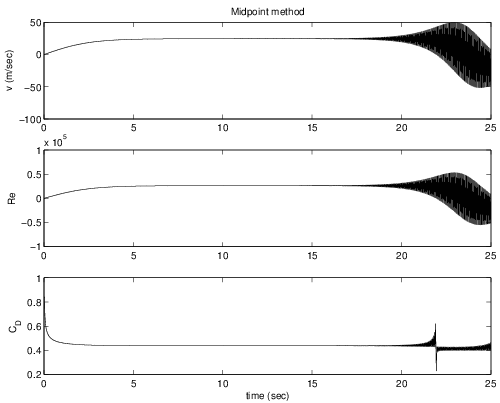

# 1.2 Discretizing ODEs
## 1.2.1 First-order ODEs

Many interesting physical phenomena can be modeled by a first-order ODE of the form

$$ u_t = f(u(t)), u(1)=u_0, 0 < t < T, \tag{1.1}$$

where $u(t)$ is the time-dependent state of the system, $u_ t=du/dt$ is the time-derivative of the state, $f(u(t))$ is the forcing function depending on the state, $u_0$ is the initial condition, and $0 < t < T$ indicates that we want to solve the problem forward in time until time $t=T$. We will begin by considering scalar problems where $u(t)\in \mathbb {R}$ (a real number), but in [1.6 Systems of ODE's and Eigenvalue Stability]() we will extend to the vector-valued case where $\mathbf{u}(t)\in \mathbb {R}$ is a $d$-dimensional state vector.

Example
-------

Consider transient heat transfer associated to convective heating or cooling (see [16\. Unified notes on Thermodynamics and Propulsion, Section 18.3](http://web.mit.edu/16.unified/www/SPRING/propulsion/notes/node129.html)). The first law states that the heat into the object is given by the product $\rho V c T_ t$ where $\rho$ is the density, $V$ is the volume, and $c$ is the specific heat. Let $h$ be the heat transfer coefficient and $A$ be the surface area of the body, then the time evolution of temperature is given by

$$A h (T-T_\infty ) = - \rho V c T_ t \tag{1.2}$$

Let $u(t)$ be the non-dimensional temperature difference $(T-T_\infty )/(T_ i-T_\infty )$ where $T(t)$ is the time-dependent temperature in the body (assumed constant throughout, i.e., small Biot number), $T_\infty$ is the surrounding ambient temperature, and $T_i$ is the initial temperature of the body at time $t=0$. Then the governing equation is

$$u_t = -\lambda u \tag{1.3}$$

where $\lambda = \frac{h A}{\rho V c}$. The initial condition is $u(0)=1$.

Write down the analytical solution to the initial value problem and plot it in MATLAB® for values $h=3$, $A=4$, $\rho =10$, $V=9$, and $c=1$. What is the value of $u(2)$? Please answer with at least 3 significant digits.  

 Solution:

0.76592833

## 1.2.2 An example of first order ODE

Ordinary differential equations (ODEs) occur throughout science and engineering.

### Free Fall Example

A model for the velocity $u(t)$ of a spherical object falling freely through the 
atmosphere can be derived by applying Newton's Law. Specifically,

$$ m_ p u_ t = m_ p g - D(u) \tag{1.4} $$

where $m_p$ is the mass of the particle, $g$ is the gravity, $D$ is the aerodynamic 
drag acting on the particle, and $u_t$ denotes the derivative of $u(t)$ with respect 
to time $t$. For low speeds, this drag can be modeled as (recall Unified fluids),

$$\begin{align}
D&=\frac{1}{2}\rho _ g \pi a^2 u^2 C_ D(Re) \tag{1.5}\\
Re &= \frac{2 \rho _ g u a}{\mu _ g} \tag{1.6}\\
C_ D &= \frac{24}{Re} + \frac{6}{1 + \sqrt  {Re}} + 0.4 \tag{1.7}
\end{align}$$

where $\rho _ g$ and $\mu _ g$ are the density and dynamic viscosity of the atmosphere, 
$a$ is the sphere radius, $Re$ is the Reynolds number for the sphere, and $C_ D$ is 
the drag coefficient. To complete the problem specification, an initial condition is 
required on the velocity. For example, at time $t=0$, let $u(0) = u_0$. By solving **Equation 1.4** 
with this initial condition, the velocity at any time $u(t)$ can be found.

### General ODEs

A general ODE is typically written in the form,

$$u_t(t) = f(u(t),t) \tag{1.8}$$

where $f(u(t),t)$ is the forcing function that results in the evolution of $u(t)$ in time. When $f(u(t),t)$ depends on $u(t)$ in a nonlinear manner, then the ODE is called a nonlinear ODE. Note that in these notes, where clarity permits, we will omit the arguments of functions.

For the example defined by Equation 1.4, the forcing function is,

$$f(u,t) = g - \frac{1}{m_p} D(u) \tag{1.9} $$

From the definition of $D(u)$, $f(u,t)$ is nonlinear in $u$. Note also that in this example, $f$ does not depend on $t$ directly, rather $f(u(t),t) = f(u(t))$.

Linear ODEs
Although the use of numerical integration is most important for nonlinear ODE's (since analytic solutions rarely exist), the study of numerical methods applied to linear ODE's is often quite helpful in understanding the behavior for nonlinear problems. The general form for a single, linear ODE, is

$$ u_t = \lambda (t) u(t) + g(t), \tag{1.10} $$

where $\lambda (t)$ is independent of $u$. When $\lambda (t)$ is a constant, the ODE is referred to as a linear ODE with constant coefficients.

In many situations, the linear ODE is derived by linearizing a nonlinear ODE about a constant state. Specifically, define the dependent state $u(t)$ as a sum of $u_0$ and a perturbation, $\tilde{u}(t)$,

$$u(t) = u_0 + \tilde{u}(t). \tag{1.11}$$

A linearized equation for the evolution of $\tilde{u}(t)$ can be derived by substitution of this into **Equation 1.8**:

$$
\begin{align}
u_t  &= f(u(t),t) \tag{1.12} \\
\tilde{u}_t &= f(u_0 + \tilde{u}(t),t) \tag{1.13} \\
\tilde{u}_t &= f(u_0, 0) + \left.\frac{\partial f}{\partial u}\right|_{u_0,0}\tilde{u}(t) + \left.\frac{\partial f}{\partial t}\right|_{u_0,0}t + O(t^2, \tilde{u} t, \tilde{u}^2) \tag{1.14}
\end{align}
$$

Note that the last equation is obtained using Taylor series. Thus, when $t$ and $\tilde{u}$ are small, the perturbation satisfies the linear equation,

$$ \tilde{u}_ t \approx f(u_0, 0) + \left.\frac{\partial f}{\partial u}\right|_{u_0,0}\tilde{u}(t) + \left.\frac{\partial f}{\partial t}\right|_{u_0,0}t \tag{1.15} $$

Comparing Equation 1.10 to 1.15, we see that in this example,

$$\begin{align}
\lambda (t) &= \left.\frac{\partial f}{\partial u}\right|_{u_0,0} \tag{1.16} \\
g(t) &= f(u_0, 0) + \left.\frac{\partial f}{\partial t}\right|_{u_0,0}t \tag{1.17}
\end{align}$$

For the falling sphere problem, a linear ODE can be derived by linearizing about the initial velocity $u_0$. As shown above, this requires the calculation of ${\partial f}/{\partial u}$ and ${\partial f}/{\partial t}$. For the sphere,

$$ \frac{\partial f}{\partial u} = \frac{\partial }{\partial u}\left[ g - \frac{1}{m_ p} D(u(t))\right] = -\frac{1}{m_ p}\frac{\partial D}{\partial u} \tag{1.18} $$

The value of ${\partial D}/{\partial u}$ is

$$
\begin{align}
\frac{\partial D}{\partial u} &= \frac{\partial }{\partial u}\left[ \frac{1}{2}\rho _ g \pi a^2 u^2 C_ D(Re) \right] \tag{1.19} \\
&= \rho _ g \pi a^2 u C_ D(Re) + \frac{1}{2}\rho _ g \pi a^2 u^2 \frac{\partial C_ D}{\partial Re}\frac{\partial Re}{\partial u} \tag{1.20}
\end{align}
$$

and ${\partial C_ D}/{\partial Re}$ and ${\partial Re}/{\partial u}$ can be found from their definitions. Also, since $f$ does not directly depend on $t$ for this problem, ${\partial f}/{\partial t} = 0.$

## 1.2.3 Discretization

When you plot the solution in MATLAB®, you are likely creating two vectors: one corresponding to points in time $t=[t_0, t_1, \ldots ,t_ N]$ and another corresponding to the solution $\mathbf{u}(t)= [u(t_0),u(t_1),\ldots ,u(t_ N)]$ at those points in time. This process of representing a continuous function by a finite set of numbers is referred to as discretization. The main idea is illustrated in Figure 1.1. Instead of representing the function continuously, we represent it as a finite set of ordered pairs $(t_ n, u(t_ n))$.

**Figure 1.1:** Numerical solutions are represented as a finite set of ordered pairs (blue dots) representing the discretization of a continuous function.
 
When we solve mathematical problems on a computer, it will always be necessary to discretize them. For initial value problems, we will begin with the initial condition $u_0$ at time $t=0$ and solve forward in time. First we select a time step ${\Delta t}>0$ representing the length of the interval between any two adjacent time points $t_ n$ and $t_{n+1}$. Although it is not necessary to choose a constant ${\Delta t}$ for the entire simulation, this is the approach we will take for this course. (You should be aware that state of the art numerical simulation codes adaptively select the time step, e.g., based on an estimate of the error.) Our numerical solution will then involve computing an approximation to the solution $u(t_ n)$ using information up to (and sometimes including, see implicit methods) time step $n$.

## 1.2.4 The Forward Euler Method

We now consider our first numerical method for ODE integration, the forward Euler method. The general problem we wish to solve is to approximate the solution $u(t)$ for Equation 1.8 with an appropriate initial condition, $u(0) = u_0$. Usually, we are interested in approximating this solution over some range of $t$, say from $t = 0$ to $t = T$. Or, we may not know a precise final time but wish to integrate forward in time until an event occurs (e.g. the problem reaches a steady state). In either case, the basic philosophy of numerical integration using finite difference methods is to start from a known initial state, $u(0)$, and somehow approximate the solution a small time forward, $u({\Delta t})$ where ${\Delta t}$ is a small time increment. Then, we repeat this process and move forward to the next time to find, $u(2{\Delta t})$, and so on. Initially, we will consider the situation in which ${\Delta t}$ is fixed for the entire integration from $t=0$ to $T$. However, the best methods for solving ODE's tend to be adaptive methods in which ${\Delta t}$ is adjusted depending on the current approximation.

Before moving on to the specific form of the forward Euler method, let's put some notations in place. Superscripts will be used to indicate a particular iteration, that is $t^ n$ denotes the time at iteration $n$. Thus, assuming constant ${\Delta t}$,

$$ t^ n = n{\Delta t}. \tag{1.21}$$

The approximation from the numerical integration will be defined as $v$. Thus, using the superscript notation,

$$ v^ n = \mbox{the approximation of } u(t^ n). \tag{1.22} $$

Now, let's derive the forward Euler method. There are several ways to motivate the forward Euler method. We will start with an approach based on Taylor series. Specifically, the Taylor expansion of $u(t^{n+1})$ about $t^ n$ is,

$$ u(t^{n+1}) = u(t^ n) + {\Delta t}u_ t(t^ n) + \frac{1}{2}{\Delta t}^2 u_{tt}(t^ n) + O({\Delta t}^3). \tag{1.23} $$

Using only the first two terms in this expansion,

$$ u(t^{n+1}) \approx u(t^ n) + {\Delta t}u_ t(t^ n). \tag{1.24} $$

Finally, the term $u\_ t(t^ n)$ is in fact just $f(u(t^ n),t^ n)$ since the governing equation is **Equation 1.8**. Thus,

$$ u(t^{n+1}) \approx u(t^ n) + {\Delta t}f(u(t^ n),t^ n) \tag{1.25} $$

Since we do not know $u(t^ n)$, we will instead use the approximation from the previous timestep, $v^ n$. Thus, the forward Euler algorithm is,

$$ v^{n+1} = v^ n + {\Delta t}f(v^ n,t^ n) \qquad \mbox{for} \qquad n \geq 0, \tag{1.26} $$

and $v^0 = u(0)$.

### Falling Ice Problem

Now, let's apply the forward Euler method to solving the falling sphere problem. Suppose the sphere is actually a small particle of ice falling in the atmosphere at an altitude of approximately 3000 meters. Specifically, let's assume the radius of the particle is $a = 0.01 m$. Then, since the density of ice is approximately $\rho _ p = 917 \, kg/m^3$, the mass of the particle can be calculated from,

$$ m_ p = \rho _ p \mbox{Volume}_ p = \rho _ p \frac{4}{3}\pi a^3 = 0.0038\, kg \tag{1.27} $$

At that altitude, the properties of the atmosphere are:

$$
\begin{align}
\rho _ g &= 0.9\, kg/m^3 \tag{1.28} \\
\mu _ g  &= 1.69 E{-5}\, kg/(m\, sec) \tag{1.29} \\
g &= 9.8 m/sec^2 \tag{1.30}
\end{align}
$$

We expect the particle to accelerate until it reaches its terminal velocity which will occur when the drag force is equal to the gravitational force. But, a priori, we do not know how long that will take (in class, we will discuss some ways to make this estimate). For now, let's set $T= 25\, sec$ and use a timestep of ${\Delta t}= 0.25\, sec$. The results are shown in Figure 1.2.

**Figure 1.2:** Behavior of velocity, Reynolds number, and drag coefficient as a function of time for an ice particle falling through the atmosphere. Simulation performed using the forward Euler method with ${\Delta t}= 0.25\, sec$.

## 1.2.5 The Midpoint Method

Now, let's look at another integration method known as the midpoint method. For this method, we will use a slightly different point of view to derive it. Specifically, let's start from the definition of a derivative,

$$ u_ t(t) = \lim _{{\Delta t}\rightarrow 0} \frac{u(t+{\Delta t}) - u(t-{\Delta t})}{2{\Delta t}} \tag{1.31} $$

Now, instead of taking the limit, assume a finite ${\Delta t}$. Then, we end up with an approximation to $du/dt$:

$$ u_ t(t) \approx \frac{u(t+{\Delta t}) - u(t-{\Delta t})}{2{\Delta t}} \qquad \mbox{for small } {\Delta t}  \tag{1.32} $$

Then, we can re-arrange this to the following estimate for $u(t+{\Delta t})$,

$$ u(t+{\Delta t}) \approx u(t-{\Delta t}) + 2{\Delta t}u_ t(t) \tag{1.33} $$

Then, following the same process as in the forward Euler method, we arrive at the midpoint method,

$$ v^{n+1} = v^{n-1} + 2{\Delta t}f(v^ n, t^ n) \qquad \mbox{for} \qquad n \geq 1 \tag{1.33} $$

However, because of the use of $v^{n-1}$, the midpont method can only be applied for $n \geq 1$. Thus, for the first timestep a different numerical method must be applied (e.g. the forward Euler method).

We will now solve the falling ice problem using the midpoint method. Using the same values of ${\Delta t}$ and $T$ as before, the results are shown in **Figure 1.3.**

**Figure 1.3:** Behavior of velocity, Reynolds number, and drag coefficient as a function of time for an ice particle falling through the atmosphere. Simulation performed using the midpoint method with ${\Delta t}= 0.25\, sec$.

Clearly, something has gone wrong here as the results show non-physical oscillations. Perhaps the oscillations will disappear if we take a smaller timestep. To test out this hypothesis, let's re-run the midpoint method with ${\Delta t}= 0.025\, sec$ which is one-tenth the previous timestep. Those results are shown in Figure 1.4. Unfortunately, while the results are better, the oscillations are clearly still present. For this problem, clearly the forward Euler method is a better choice than the midpoint method. We will see why this has happened in a few lectures.

**Figure 1.4:** Behavior of velocity, Reynolds number, and drag coefficient as a function of time for an ice particle falling through the atmosphere. Simulation performed using the midpoint method with ${\Delta t}= 0.025\, sec$.
